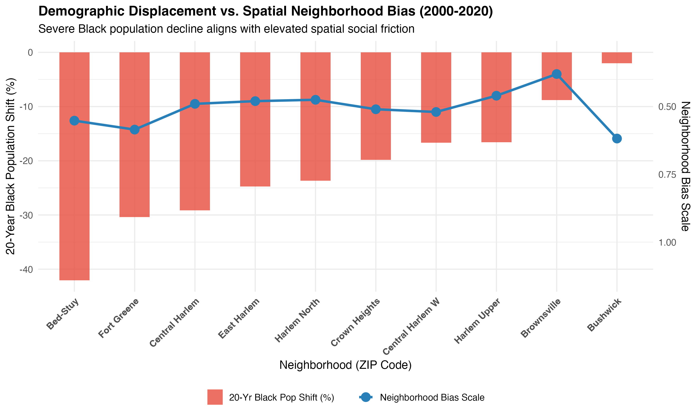

# belonging-archive-spatial
Open-access spatial data pipelines, R scripts, and spatial layers for The Belonging Archive.
# 🗺️ belonging-archive-spatial

Open-access spatial data pipelines, econometric models, and IRB-approved spatial ethnography mapping social infrastructure, digital spatiality, and economic mobility across NYC.

*Maintained by **Jacob Frye** | The Belonging Archive*

---

## 📌 Featured Research Module: *Designing Proxemics*

**Comparative Axis:** Pre-Smartphone Physical Anchors vs. Today's Smartphone-Mediated Space  
In pre-smartphone New York City, physical spatial nodes—ranging from Fulton Mall to early hip-hop gathering spots—served as essential anchors for Black cultural life, informal social capital, and local network expansion. *Designing Proxemics* uncovers how commercial shifts, gentrification, and smartphone-mediated space have fundamentally altered how youth navigate physical proximity, build spatial trust, and make economic decisions.

---

## 📊 Data Directory & Codebook

This repository houses cleaned datasets, dyadic spatial network panels, and econometric model exports for Brooklyn and Upper Manhattan.

### 📑 Dataset Inventory

| File Name | Geographic Unit | Description |
| :--- | :--- | :--- |
| `brooklyn_harlem_urban_econ_tract_clean.csv` | Census Tract | Merged panel tracking commute times, job density, housing costs, and 2016 median income. |
| `brooklyn_social_capital_clean.csv` | ZIP Code | Opportunity Insights social capital metrics across 35 Brooklyn ZIP codes. |
| `harlem_social_capital_clean.csv` | ZIP Code | Opportunity Insights social capital metrics across 8 Harlem/Upper Manhattan ZIP codes. |
| `brooklyn_meta_digital_independent.csv` | ZIP Dyad | Meta Social Connectedness Index (SCI) panel for ties originating from Brooklyn. |
| `harlem_meta_digital_independent.csv` | ZIP Dyad | Meta Social Connectedness Index (SCI) panel for ties originating from Harlem. |
| `Integrated_Neighborhood_College_Dataset.csv` | Neighborhood | Neighborhood dataset linking Black population shifts (2000–2020), social capital, upward mobility, and CUNY mobility rates. |
| `brooklyn_harlem_regression_results.csv` | Model Outputs | Tidy OLS regression results across system-level and regional models. |

---

## 🔍 Key Data Dictionaries

### 1. Social Capital Atlas Metrics (`*_social_capital_clean.csv`)
* **`zip`**: 5-Digit Postal ZIP Code FIPS
* **`county`**: County FIPS Code (`36047` = Kings/Brooklyn, `36061` = New York/Manhattan)
* **`ec_zip`**: Economic Connectedness score (share of high-SES friends)
* **`nbhd_ec_zip`**: Neighborhood exposure component of Economic Connectedness
* **`ec_grp_mem_zip`**: Economic Connectedness forged via civic, religious, and formal group memberships
* **`nbhd_bias_zip`**: Neighborhood friending bias metric

### 2. Digital Spatial Networks (`*_meta_digital_independent.csv`)
* **`user_region`**: Origin ZIP Code (Brooklyn or Harlem)
* **`friend_region`**: Destination ZIP Code / FIPS region
* **`scaled_sci`**: Scaled Meta Social Connectedness Index score (relative tie probability)

### 3. Integrated Neighborhood & Anchor Dataset (`Integrated_Neighborhood_College_Dataset.csv`)
* **`Black_Pop_Shift_00_20`**: Percentage shift in Black population (2000–2020 gentrification metric)
* **`Tract_Upward_Mobility_Rank`**: Mean income percentile rank for children from low-income families
* **`Anchor_CUNY_Mobility_Rate`**: Institutional economic mobility rate for local anchor CUNY colleges

* ### 📂 Analytical Datasets (`outputs/` & `data/`)

- **`clean_combined_dyads.csv`**: 1,849 dyadic spatial network observations linking Brooklyn and Harlem ZIP pairs. Contains log-scaled Social Connectedness Index (`log_sci`), tie classifications (`tie_type`), and origin/destination social capital covariates.
- **`social_capital_core_variables.csv`**: Lightweight 43-ZIP panel isolating core Economic Connectedness (`ec_zip`) and Neighborhood Friending Bias (`nbhd_bias_zip`) across Brooklyn and Upper Manhattan.
- ## 📈 Key Findings & Visualizations

### 1. The Gentrification Paradox

*Figure 1: Strong positive correlation (r = +0.939) between Economic Connectedness and child upward mobility ranks across Brooklyn and Harlem study tracts, sized by 20-year demographic displacement severity.*

---

### 2. Demographic Displacement vs. Neighborhood Social Bias

*Figure 2: 20-year Black population shifts (2000–2020) mapped against spatial neighborhood bias scales across focal study corridors.*

---

### 3. CUNY Anchor Institutional Mobility

*Figure 3: CUNY institutions ranked by bottom-to-top 20% income mobility rates (Opportunity Insights data).*

---

## 🛠️ Data Sources & Citation
- **US Census Bureau:** ACS 5-Year Estimates (2016)
- **Opportunity Insights:** Social Capital Atlas & Opportunity Atlas (Chetty et al.)
- **Meta Data for Good:** Social Connectedness Index (SCI)
- **The Belonging Archive:** [www.thebelongingarchive.com](https://www.thebelongingarchive.com)
